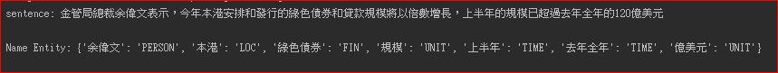
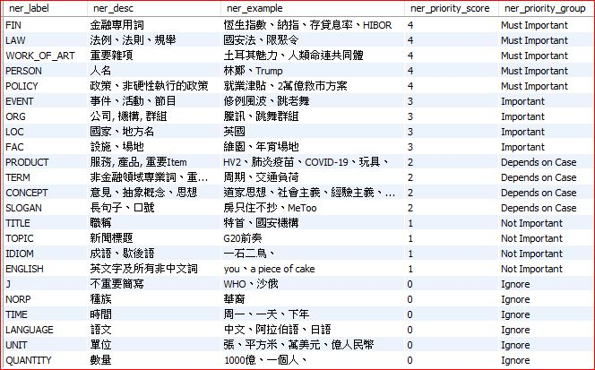
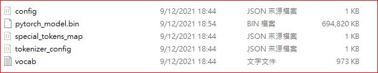
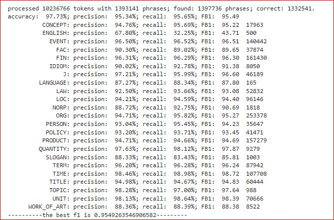
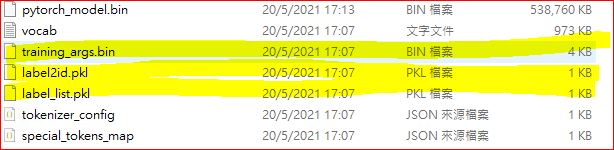

# nlp_NER_model

This repository aims to implement Name Entity Recognition (NER) work based on google's pretrained BERT model and BiLSTM-CRF network! 

This mode design is focusing on handling Chinese data from ETNET financial news and lifestyle financial articles. For textual data outside these scopes, e.g. ETNET DIVA and SoIN, etc., pleease retrain the model with relevant corpus.

This project is built on Python3.7 or above

--------------------------------------------------------------------------------------------------------------------------------------------------------------------------

### Input and output of [model deployment](https://github.com/etnetapp-dev/nlp_NER_model/deployment.py)

 
 
 

### Name Entity definition

 
#### Key dependencies
    python (>= 3.7.9)
    pytorch (>= 1.8) (cpu version for deployment, gpu version for development) (https://pytorch.org/)
    pytorch-crf == 1.2 (https://github.com/statech/pytorchCRF)
    transformers == 4.5.1  (https://github.com/huggingface/transformers)         
    
    
--------------------------------------------------------------------------------------------------------------------------------------------------------------------------

### Preparation of model training
- Convert training data
首先将数据处理成BIO格式，processed文件夹下存放的是医疗命名实体识别的数据，代码可参考data_process.ipynb
下载中文BERT预训练模型,来自pytorch-pretrained-bert

#### input of training model in BIO format：
    集 B-ORG
    團 I-ORG
    透 O
    過 O
    收 B-EVENT
    購 I-EVENT
    喜 B-ORG
    力 I-ORG
    啤 B-PRODUCT
    酒 I-PRODUCT
    ， O
    進 O
    行 O
    升 B-EVENT
    級 I-EVENT
    和 O
    多 O
    樣 O
    化 O
    產 B-PRODUCT
    品 I-PRODUCT
    的 O
    需 B-TERM
    求 I-TERM
    將 O
    推 O
    動 O
    平 O
    均 O
    售 O
    價 O
    ， O
    集 B-ORG
    團 I-ORG
    定 O
    位 O
    中 O
    高 O
    檔 O
    啤 B-PRODUCT
    酒 I-PRODUCT
    市 B-J
    場 I-J
    亦 O
    有 O
    助 O
    推 O
    動 O
    盈 B-TERM
    利 I-TERM
    前 I-TERM
    景 I-TERM
    及 O
    毛 B-TERM
    利 I-TERM
    率 I-TERM
    。 O

--------------------------------------------------------------------------------------------------------------------------------------------------------------------------

#### Pre-trained model downloaded and saved
[download_transformers_models_iipynb.ipynb](https://github.com/etnetapp-dev/nlp_NER_model/download_transformers_models_iipynb.ipynb)

### Pretrained model set and relevant file after downloaded

--------------------------------------------------------------------------------------------------------------------------------------------------------------------------
#### Model training
[bert_bilstm_crf_ner_training.ipynb](https://github.com/etnetapp-dev/nlp_NER_model/bert_bilstm_crf_ner_training.ipynb)

#### Name Entity accuracy of model training

#### Trained model set and relevant file 

--------------------------------------------------------------------------------------------------------------------------------------------------------------------------

 changing model precision (from FP32 to FP16)  
#### Model conversion from fp32 to fp16
[convert_model_to_fp16.ipynb](https://github.com/etnetapp-dev/nlp_NER_model/convert_model_to_fp16.ipynb)

BERT-base is model contains 110M parameters.  It’s hard to deploy a model of such size into many environments with limited resources
 changing model precision (from FP32 to FP16)  compress and speed-up NN models have been developed.
 Typically models trained using FP32 (32-bit floating point), then they can be quantized into FP16 (16-bit floating point), so reducing the model size 2x . 
 This is called post-training quantization.

#### Deployment
[deployment.py](https://github.com/etnetapp-dev/nlp_NER_model/deployment.py)
